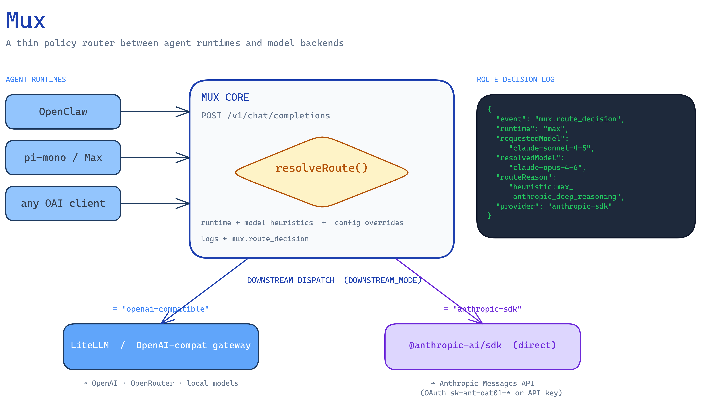
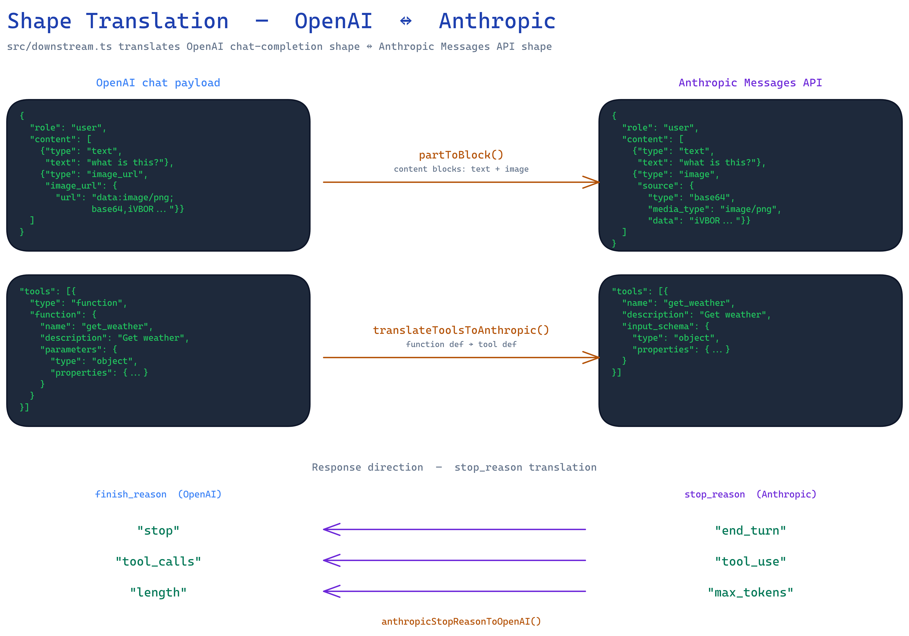
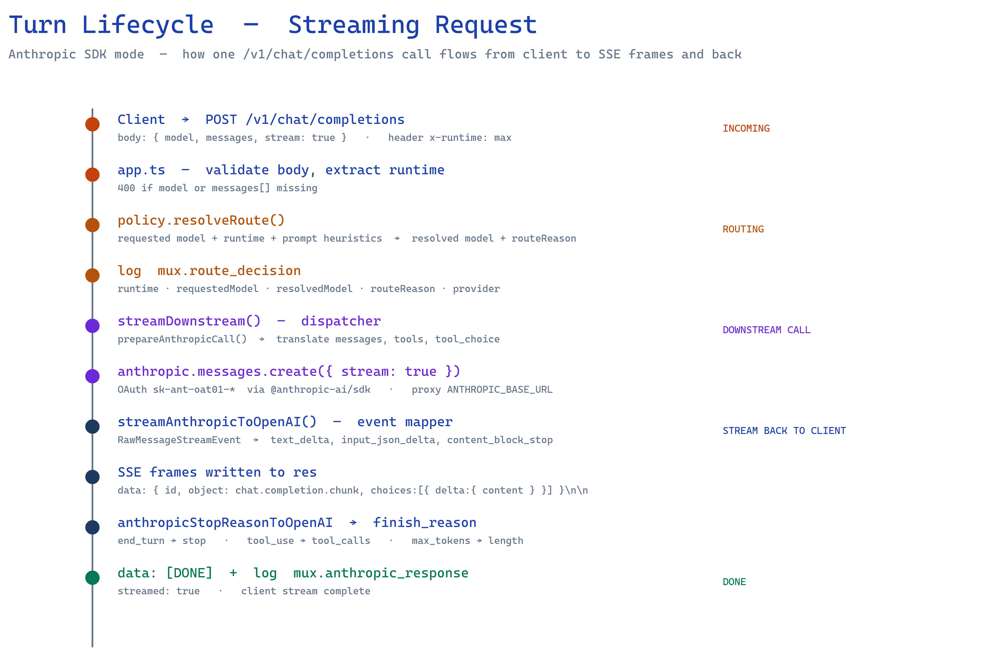

# Mux

A thin model routing and policy layer for agent runtimes.

Mux sits in front of existing model gateways/providers and makes system-driven routing decisions based on policy, not per-user micromanagement. It is designed to work across multiple agent runtimes like OpenClaw and pi-mono/Max, while emitting rich routing telemetry to AgentWeave from day one.

## Why Mux exists

Strong models are expensive. Cheap models are often good enough.

In practice, personal agent stacks end up with the same problem:
- one runtime uses a strong model by default
- another runtime has a different provider abstraction
- fallbacks and routing are hard to reason about
- token/cost usage becomes visible only after the bill hurts

Mux is the control point for that problem.

## Core idea

Mux provides:
- an OpenAI-compatible endpoint
- a lightweight policy engine
- routing decisions across models/providers
- fallback/escalation handling
- routing metadata for observability

AgentWeave remains the observability layer. Mux is the policy/control layer.

## Architecture at a glance

Mux sits between heterogeneous agent runtimes and heterogeneous model backends. One OpenAI-compatible endpoint, a policy layer, and a downstream dispatcher selected via `DOWNSTREAM_MODE`.



Inside `src/downstream.ts`, Mux translates OpenAI chat-completion shape to and from the Anthropic Messages API — content blocks (text + image), tools, and stop reasons all map across:



End-to-end, a single streaming request flows through validation, routing, the Anthropic SDK, and an event mapper that rewrites Anthropic stream events as OpenAI SSE chunks on the way back to the client:



The diagram sources live in [`docs/diagrams/`](./docs/diagrams/) as `.excalidraw` files and can be re-rendered with the [excalidraw-diagram-skill](https://github.com/coleam00/excalidraw-diagram-skill).

## Initial goals

- Support OpenClaw and pi-mono/Max through one shared endpoint
- Route requests by simple policy heuristics first
- Track requested model vs resolved model
- Capture why a route happened
- Emit routing spans/attributes for AgentWeave

## Non-goals for v0

- perfect learned routing
- enterprise auth/governance features
- supporting every provider under the sun
- replacing LiteLLM or OpenRouter wholesale

## Expected architecture

Client runtime (OpenClaw / pi-mono)
→ Mux policy layer
→ downstream provider or gateway
→ response back to client

Along the way, Mux records:
- runtime
- agent/session context
- requested model
- resolved model
- route reason
- fallback/escalation path
- cost and latency metadata

## MVP success criteria

- OpenClaw can use Mux as its model endpoint
- Max/pi-mono can use Mux as its model endpoint
- simple prompts route to a cheaper model
- harder prompts can escalate to a stronger model
- routing decisions are visible in AgentWeave

---

## MVP implementation (review build)

This repo now includes a reviewable MVP skeleton with:

- `POST /v1/chat/completions` (OpenAI-compatible shape)
- `GET /health`
- simple rule-based routing/policy stub (requested model -> resolved model)
- structured route decision logs
- downstream passthrough abstraction (LiteLLM/OpenAI-compatible + explicit mock fallback)
- unit tests for routing and downstream behavior

### Stack

- **Node.js + TypeScript**
- **Express** for HTTP
- **Pino** for structured JSON logs
- **Vitest** for basic tests

Chosen for fast local setup, low code surface area, and easy review.

### Quick start

```bash
cd /home/Arnab/clawd/projects/mux
npm install
cp .env.example .env
npm run dev
```

Server runs on `http://localhost:8787` by default.

### Run with LiteLLM locally

Mux expects an OpenAI-compatible backend and is tested against LiteLLM's `/v1/chat/completions` interface.

1. Start LiteLLM (example):

```bash
litellm --host 0.0.0.0 --port 4000
```

2. In `.env`, point Mux to LiteLLM:

```bash
DOWNSTREAM_MODE=openai-compatible
DOWNSTREAM_BASE_URL=http://localhost:4000/v1
DOWNSTREAM_API_KEY= # optional, based on auth mode
DOWNSTREAM_AUTH_MODE=bearer
DOWNSTREAM_EXTRA_HEADERS={}
DOWNSTREAM_TIMEOUT_MS=30000
DOWNSTREAM_MOCK_FALLBACK=false
```

3. Start Mux (`npm run dev`) and send OpenAI-compatible requests to Mux.

### Run with Anthropic OAuth via Node SDK (Option 2)

This path is for Anthropic OAuth tokens (`sk-ant-oat01-*`) where raw HTTP/curl-style calls are not reliable.
Mux uses the official `@anthropic-ai/sdk` directly.

```bash
DOWNSTREAM_MODE=anthropic-sdk
ANTHROPIC_OAUTH_TOKEN=sk-ant-oat01-...
ANTHROPIC_BASE_URL=http://arnabsnas.local:30400
DOWNSTREAM_TIMEOUT_MS=30000
```

Notes:
- Keep sending OpenAI-compatible requests to Mux (`/v1/chat/completions`); Mux translates to Anthropic Messages API internally.
- `ANTHROPIC_API_KEY` can be used instead of `ANTHROPIC_OAUTH_TOKEN` for non-OAuth setups.
- In `anthropic-sdk` mode, LiteLLM/OpenAI downstream auth settings are ignored.

### Local DNS / hosting

Mux is hosted on a NAS that advertises itself as `arnabsnas.local` via avahi/mDNS. LAN clients should prefer `arnabsnas.local:<PORT>` over raw IPs so setups survive DHCP lease changes without needing router DNS entries. Co-resident services on the NAS can still hit `localhost:<PORT>` for loopback performance.

### Test

```bash
npm test
```

### Example request

```bash
curl -s http://localhost:8787/v1/chat/completions \
  -H 'content-type: application/json' \
  -H 'x-runtime: openclaw' \
  -d '{
    "model": "gpt-4o",
    "messages": [{"role": "user", "content": "say hi"}]
  }' | jq
```

### Current behavior

- If the request is for a Claude model (`claude-*`) and `ANTHROPIC_MODEL_MAP` includes it, that Anthropic-specific mapping wins.
- Else, for Max runtime Claude requests (`runtime: max` or `x-runtime: max`), Mux applies a first-pass Anthropic policy:
  - lightweight/general chat → `claude-sonnet-4-6`
  - coding/debug/troubleshooting → `claude-sonnet-4-6`
  - deeper planning/complex reasoning → `claude-opus-4-6`
- Else, if `MODEL_MAP` includes the requested model, that mapping wins.
- Else, `gpt-4o` is downgraded to `gpt-4o-mini` for simple prompts.
- If prompt appears complex (basic keyword heuristic), model is kept.
- `DOWNSTREAM_MODE=openai-compatible` (default):
  - If `DOWNSTREAM_BASE_URL` is set, Mux forwards to `${DOWNSTREAM_BASE_URL}/chat/completions` with the resolved model.
  - Downstream auth is configurable via `DOWNSTREAM_AUTH_MODE`:
    - `bearer` (default): `Authorization: Bearer ${DOWNSTREAM_API_KEY}`
    - `x-api-key`: `x-api-key: ${DOWNSTREAM_API_KEY}`
    - `passthrough`: forwards inbound `Authorization` header as-is
    - `none`: no auth header
  - Optional static headers can be added with `DOWNSTREAM_EXTRA_HEADERS` (JSON map).
  - If `DOWNSTREAM_BASE_URL` is not set:
    - and `DOWNSTREAM_MOCK_FALLBACK=true`, Mux returns an explicit local mock response (safe dev path)
    - and `DOWNSTREAM_MOCK_FALLBACK=false`, Mux returns `503 service_unavailable`
- `DOWNSTREAM_MODE=anthropic-sdk`:
  - Mux calls Anthropic via Node SDK (`@anthropic-ai/sdk`) using `ANTHROPIC_OAUTH_TOKEN` (or `ANTHROPIC_API_KEY`).
  - Optional `ANTHROPIC_BASE_URL` supports proxy endpoints like `http://arnabsnas.local:30400`.
  - Current limitations: no streaming support yet and chat role mapping is text-only (system/user/assistant; `tool` is flattened to text).

### Environment variables

- `PORT` (default `8787`)
- `NODE_ENV` (default `development`)
- `MODEL_MAP` (JSON map for generic explicit model overrides)
- `ANTHROPIC_MODEL_MAP` (JSON map for Anthropic/Claude-only overrides, applied before `MODEL_MAP`)
- `DEFAULT_PROVIDER` (metadata for logs)
- `DEFAULT_BACKEND_TARGET` (metadata for logs)
- `DOWNSTREAM_MODE` (`openai-compatible` default, `anthropic-sdk`)
- `DOWNSTREAM_BASE_URL` (e.g. `http://localhost:4000/v1`, openai-compatible mode)
- `DOWNSTREAM_API_KEY` (optional key/token for openai-compatible mode)
- `DOWNSTREAM_AUTH_MODE` (`bearer` default, `x-api-key`, `passthrough`, `none`)
- `DOWNSTREAM_EXTRA_HEADERS` (JSON map, optional extra headers)
- `DOWNSTREAM_TIMEOUT_MS` (default `30000`)
- `DOWNSTREAM_MOCK_FALLBACK` (default true outside production, openai-compatible mode)
- `ANTHROPIC_OAUTH_TOKEN` (preferred in anthropic-sdk mode)
- `ANTHROPIC_API_KEY` (optional fallback in anthropic-sdk mode)
- `ANTHROPIC_BASE_URL` (optional override/proxy URL in anthropic-sdk mode)

### Structured logging fields

Each request logs:

- `runtime`
- `requestedModel`
- `resolvedModel`
- `routeReason`
- `provider`
- `backendTarget`

This is intended as the minimum routing telemetry surface before wiring into AgentWeave/OpenClaw/Max.

