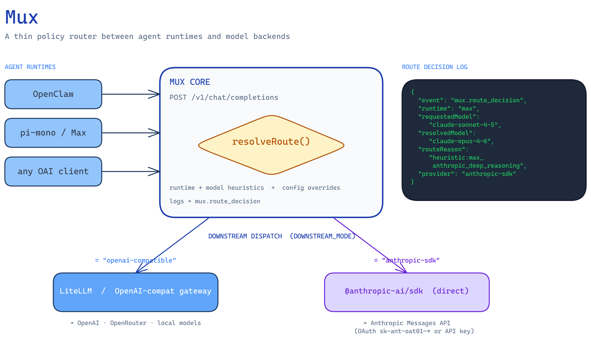
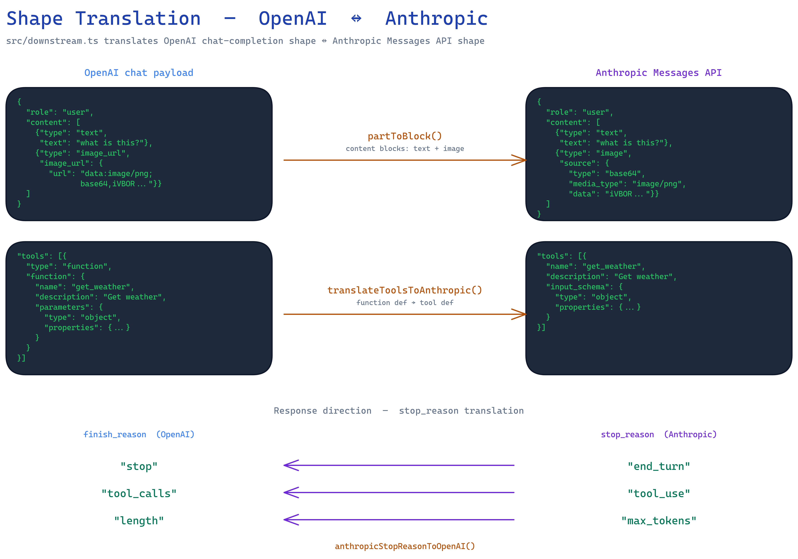
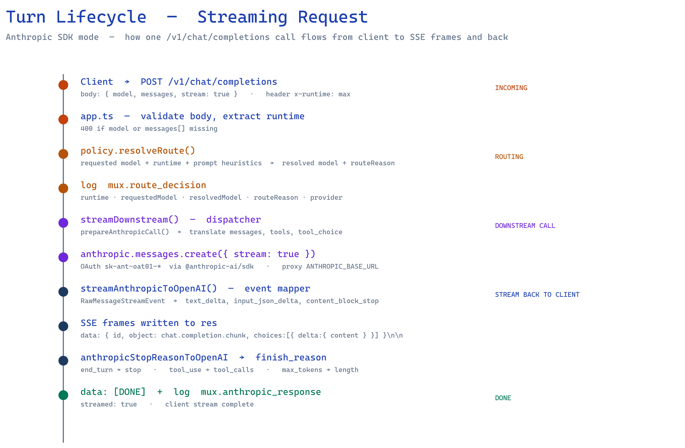

# Mux

> A thin model routing and policy layer for agent runtimes.

Mux sits in front of existing model gateways/providers and makes system-driven routing decisions based on policy, not per-user micromanagement. It is designed to work across multiple agent runtimes (OpenClaw, pi-mono/Max) while emitting rich routing telemetry to [AgentWeave](https://github.com/arniesaha/agentweave).

## Why Mux exists

Strong models are expensive. Cheap models are often good enough.

In practice, personal agent stacks end up with the same problem:
- one runtime uses a strong model by default
- another runtime has a different provider abstraction
- fallbacks and routing are hard to reason about
- token/cost usage becomes visible only after the bill hurts

Mux is the control point for that problem.

## What Mux provides

- an OpenAI-compatible `/v1/chat/completions` endpoint
- native `POST /v1/responses` passthrough for responses-capable downstreams
- a configurable policy-based routing rules
- support for routing across models and providers
- fallback and escalation handling
- structured routing metadata for observability
- an explain/dry-run route endpoint for debugging policy decisions

## Architecture

Mux sits between heterogeneous agent runtimes and heterogeneous model backends. One OpenAI-compatible endpoint, a policy layer, and a downstream dispatcher selected via `DOWNSTREAM_MODE`.



Inside `src/downstream.ts`, Mux translates OpenAI chat-completion shape to and from the Anthropic Messages API — content blocks (text + image), tools, and stop reasons all map across:



End-to-end, a single streaming request flows through validation, routing, the Anthropic SDK, and an event mapper that rewrites Anthropic stream events as OpenAI SSE chunks on the way back to the client:



## Getting started

```bash
git clone https://github.com/arniesaha/mux.git
cd mux
npm install
cp .env.example .env
npm run dev
```

Server starts on `http://localhost:8787` by default.

## Configure your downstream

### Option 1 — OpenAI-compatible backend (e.g. LiteLLM, OpenRouter)

```bash
DOWNSTREAM_MODE=openai-compatible
DOWNSTREAM_BASE_URL=https://your-gateway.com/v1   # your proxy/gateway URL
DOWNSTREAM_API_KEY=sk-...                          # your API key
DOWNSTREAM_AUTH_MODE=bearer                         # bearer | x-api-key | passthrough | none
DOWNSTREAM_EXTRA_HEADERS={}
DOWNSTREAM_TIMEOUT_MS=30000
```

### Option 2 — Anthropic SDK (direct OAuth tokens)

```bash
DOWNSTREAM_MODE=anthropic-sdk
ANTHROPIC_OAUTH_TOKEN=sk-ant-oat01-...            # Anthropic OAuth token
ANTHROPIC_BASE_URL=https://api.anthropic.com        # or your proxy URL
DOWNSTREAM_TIMEOUT_MS=30000
```

> **Note:** `anthropic-sdk` mode still accepts OpenAI-compatible chat requests only. Native `/v1/responses` is currently supported for `openai-compatible` downstreams that expose a real Responses API.

## Routing behavior

Mux routes requests using configurable policy rules:

| Request type | Resolved model |
|---|---|
| Short lightweight prompts (< 80 chars, no task cues) | `claude-haiku-4-5-20251001` |
| Coding / debugging / execution cues | `claude-sonnet-4-6` |
| Complex reasoning / planning / architecture cues | `claude-opus-4-6` |
| `gpt-4o` (simple prompts) | downgraded to `gpt-4o-mini` |

Routing for Max runtime requests is evaluated on the **last user message only** — system prompts and conversation history are ignored to prevent false escalation.

Route decisions are logged with: `runtime`, `requestedModel`, `resolvedModel`, `routeReason`, `provider`, `backendTarget`.

### Declarative routing rules

If you want something more flexible than the built-in heuristics in `src/policy.ts`,
set `ROUTING_RULES` to an ordered JSON array. First match wins.

Supported fields per rule:

- `id` — required unique identifier
- `protocols` — optional array of `chat_completions` / `responses`
- `runtime` — optional string or string[]
- `requestedModel` — optional string or string[]
- `promptIncludesAny` — optional string[] keyword match on the last user message
- `maxPromptLength` — optional upper bound for last-user-message length
- `resolvedModel` — required routed model
- `routeReason` — optional custom reason string

Example:

```bash
ROUTING_RULES='[
  {
    "id": "simple-openclaw-gpt4o",
    "runtime": "openclaw",
    "requestedModel": "gpt-4o",
    "maxPromptLength": 120,
    "resolvedModel": "gpt-4o-mini"
  }
]'
```

Config rules are applied after `MODEL_MAP` / `ANTHROPIC_MODEL_MAP` and before the built-in heuristics, so explicit overrides still win and defaults remain as fallback behavior.

### Explain / dry-run route decisions

Mux exposes a no-downstream debug endpoint:

```bash
curl -s http://localhost:8787/v1/route/resolve \
  -H 'content-type: application/json' \
  -H 'x-runtime: openclaw' \
  -d '{"model":"gpt-4o","messages":[{"role":"user","content":"say hi"}]}' | jq
```

For Responses-style callers:

```bash
curl -s http://localhost:8787/v1/route/resolve \
  -H 'content-type: application/json' \
  -d '{"protocol":"responses","model":"gpt-4o","input":[{"role":"user","content":[{"type":"input_text","text":"say hi"}]}]}' | jq
```

This returns the resolved route metadata, including `matchedRuleId` when a declarative rule fired.

### Enable native Responses routing

If you want Mux to accept `POST /v1/responses` for a legacy/default `openai-compatible` downstream, set:

```bash
DOWNSTREAM_PROTOCOLS=chat_completions,responses
```

Providers configured via `PROVIDERS` can also declare `protocols: ["chat_completions", "responses"]`.

## Example requests

```bash
curl -s http://localhost:8787/v1/chat/completions \
  -H 'content-type: application/json' \
  -H 'x-runtime: openclaw' \
  -d '{"model": "gpt-4o", "messages": [{"role": "user", "content": "say hi"}]}' | jq

curl -s http://localhost:8787/v1/responses \
  -H 'content-type: application/json' \
  -H 'x-runtime: openclaw' \
  -d '{"model": "gpt-4o", "input": [{"role": "user", "content": [{"type": "input_text", "text": "say hi"}]}]}' | jq
```

## Environment variables

| Variable | Default | Description |
|---|---|---|
| `PORT` | `8787` | Server port |
| `NODE_ENV` | `development` | Environment |
| `MODEL_MAP` | `{}` | JSON map of `requestedModel → resolvedModel` |
| `ANTHROPIC_MODEL_MAP` | `{}` | Anthropic-only routing overrides |
| `DOWNSTREAM_MODE` | `openai-compatible` | `openai-compatible` or `anthropic-sdk` |
| `DOWNSTREAM_BASE_URL` | — | Backend URL (openai-compatible mode) |
| `DOWNSTREAM_API_KEY` | — | API key for downstream auth |
| `DOWNSTREAM_AUTH_MODE` | `bearer` | `bearer` \| `x-api-key` \| `passthrough` \| `none` |
| `DOWNSTREAM_EXTRA_HEADERS` | `{}` | JSON map of extra static headers |
| `DOWNSTREAM_TIMEOUT_MS` | `30000` | Request timeout in ms |
| `DOWNSTREAM_PROTOCOLS` | `chat_completions` | Comma-separated legacy/default downstream protocols (`chat_completions`, `responses`) |
| `DOWNSTREAM_MOCK_FALLBACK` | `true` (dev) | Return mock response when no backend configured |
| `ROUTING_RULES` | `[]` | Ordered JSON array of declarative routing rules applied before built-in heuristics |
| `ANTHROPIC_OAUTH_TOKEN` | — | OAuth token (preferred for anthropic-sdk) |
| `ANTHROPIC_API_KEY` | — | API key fallback for anthropic-sdk |
| `ANTHROPIC_BASE_URL` | — | Override Anthropic API URL (supports proxies) |
| `MUX_ANTHROPIC_PROMPT_CACHE` | `true` | Inject Anthropic ephemeral `cache_control` breakpoints on the translated request (system, tools, history) |
| `TRACE_PROMPT_PREVIEW_ENABLED` | `false` | Enable prompt preview text on tracing span attrs (opt-in; disabled by default for safety) |
| `TRACE_PROMPT_PREVIEW_REDACTED_VALUE` | `[redacted]` | Value written to trace attrs when prompt preview tracing is disabled |

## Prompt caching (Anthropic)

When the downstream is Anthropic, Mux transparently injects ephemeral
`cache_control` breakpoints on the translated request so multi-turn agents
get a 90% discount on re-used input tokens (5-minute TTL).

**What gets cached**
- the translated system prompt (one breakpoint on the single text block),
- the full tools block (breakpoint on the last tool),
- the conversation history (breakpoint on the last content block of the
  last message; skipped when there's only one turn).

**Reading cache stats.** Anthropic's `cache_read_input_tokens` is surfaced
on responses as `usage.prompt_tokens_details.cached_tokens`, and both
cache-read and cache-creation tokens are rolled into `usage.prompt_tokens`
so billable-prompt size reflects the true transcript:

```json
{
  "usage": {
    "prompt_tokens": 5400,
    "completion_tokens": 20,
    "total_tokens": 5420,
    "prompt_tokens_details": { "cached_tokens": 5000 }
  }
}
```

**Cost model.** Anthropic charges a 25% surcharge on cache *writes* and a
90% discount on cache *reads*, with a 5-minute TTL. For a client that
re-uses the same system + tools across turns, turn 1 pays the write
surcharge and turns 2+ hit cache — net cost drops sharply within a single
session.

**Opt out.** Set `MUX_ANTHROPIC_PROMPT_CACHE=false` to disable.

## Compatibility

See [docs/compatibility.md](docs/compatibility.md) for the full matrix of
(provider kind × protocol × feature) combinations and which are
"supported + tested" vs "supported + untested" vs "intentionally unsupported".
The matrix is the source of truth for what mux actually validates end-to-end —
unit tests are dense, but the e2e suite under `tests/e2e/` is the gate that
asserts each public endpoint shape against `createApp()` with mocked
downstreams.

## Running tests

```bash
npm test          # unit suite (fast, hermetic)
npm run test:e2e  # end-to-end suite (in-process supertest against createApp)
npm run test:all  # both
```

## Architecture diagrams

Diagram sources are in `docs/diagrams/` as `.excalidraw` files. Re-render with the [excalidraw-diagram-skill](https://github.com/coleam00/excalidraw-diagram-skill).

## License

MIT © 2026 Arnab Saha
